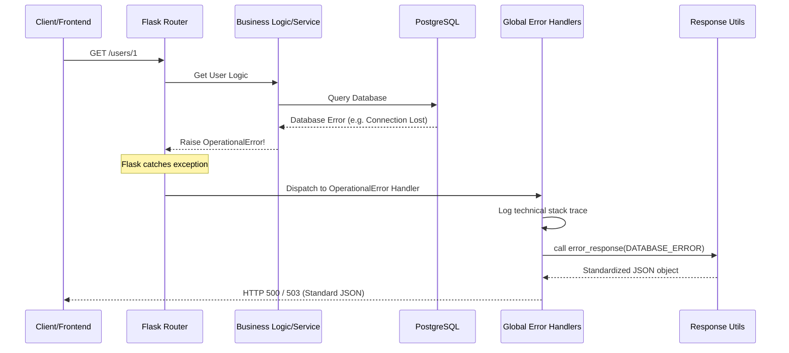
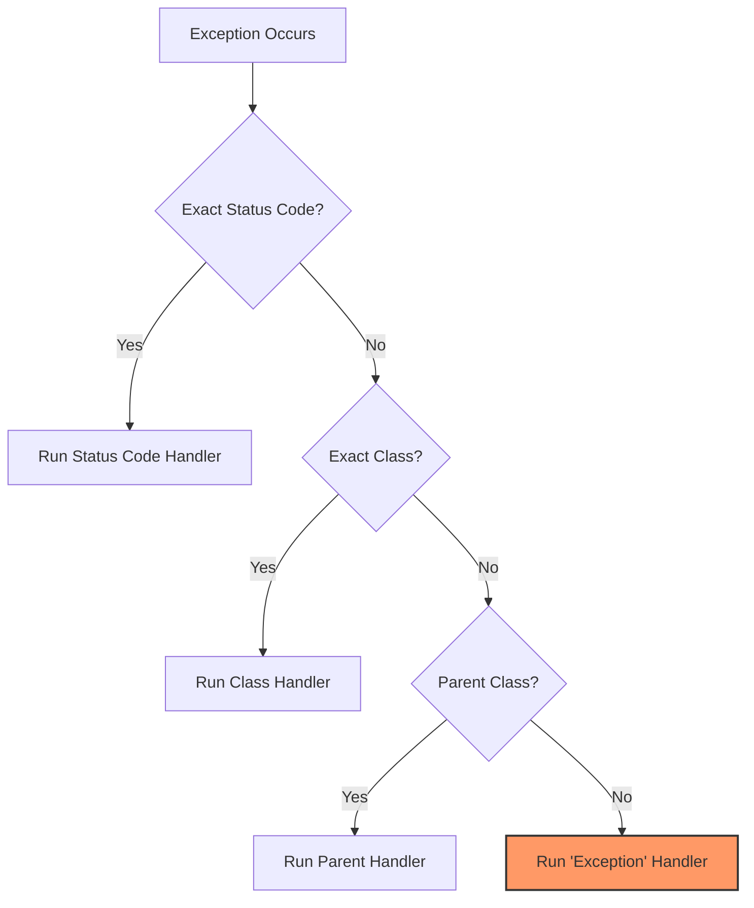

# Global Error Handling in Flask

This document explains how our application handles errors globally, ensuring that every failure—whether it's a missing route, a database crash, or an unhandled exception—returns a consistent, predictable, and secure JSON response.

## Core Concepts

### 1. Standardization

Every error response follows the same "Envelope" format:

```json
{
    "success": false,
    "data": null,
    "error": {
        "code": "ERROR_CODE",
        "message": "Human-readable message",
        "details": { ... } // Optional field-level details
    },
    "meta": null
}
```

### 2. The `@app.errorhandler` Decorator

Flask uses decorators to register "ErrorHandler" functions. When an exception occurs during a request, Flask stops normal execution and looks for a registered handler that matches the error.

## The Data Flow (Request Lifecycle)

When an error occurs, the following sequence happens:

1.  **Trigger**: An exception is raised. This can be:
    -   **Manual**: You call `abort(404)` or `raise Forbidden()`.
    -   **Automatic**: A library raises an error (e.g., SQLAlchemy raises `IntegrityError` when a unique constraint is violated).
    -   **Unhandled**: A bug in your code (e.g., `ZeroDivisionError`).
2.  **Capture**: Flask catches the exception before it crashes the server.
3.  **Matching**: Flask searches its "Error Map" to find the best-fitting handler.
4.  **Execution**: The handler function is called with the exception object as its argument.
5.  **Standardization**: The handler calls `error_response()` (from `app/utils/responses.py`) to build the JSON payload.
6.  **Response**: The client receives the JSON with the appropriate HTTP status code.

### Visual Sequence Diagram

This diagram shows the journey of a request that encounters an error (e.g., a database constraint violation).



## How Flask Knows Which Function to Run?

Flask uses a **Hierarchy-based Matching Logic**. It doesn't just pick a random function; it follows these rules in order:

### 1. Exact HTTP Status Code

If you raise an `HTTPException` (like `NotFound`), Flask checks if you have a handler registered for that specific code:

```python
@app.errorhandler(404)
def handle_not_found(e): ...
```

### 2. Specific Exception Class

If a Python exception is raised (e.g., `IntegrityError`), Flask looks for a handler registered for that specific class:

```python
@app.errorhandler(IntegrityError)
def handle_integrity_error(e): ...
```

### 3. Inheritance (Subclasses)

If no specific class handler exists, Flask checks the parent classes.

-   If `ProgrammingError` occurs (a subclass of `SQLAlchemyError`), and you haven't handled `ProgrammingError` but _have_ handled `SQLAlchemyError`, it will use the parent handler.
-   This is why we have `@app.errorhandler(HTTPException)` as a catch-all for any Werkzeug error.

### Visual Hierarchy Matching

When an error happens, Flask searches for a handler like this (from most specific to least specific):



## Special Cases: Pydantic & flask-openapi3

`flask-openapi3` handles validation **before** your route is even called. Because it's a library hook, it uses a callback instead of an exception handler:

-   **Pydantic Callback**: Registered in `OpenAPI(..., validation_error_callback=...)`.
-   **Why?**: This allows the library to transform Pydantic's complex error structure into our standard format _before_ the request is rejected.

## Detailed Handlers List

| Handler                       | Responds To                  | Common Triggers                           |
| :---------------------------- | :--------------------------- | :---------------------------------------- |
| `handle_bad_request` (400)    | `abort(400)`                 | Malformed JSON, missing headers.          |
| `handle_not_found` (404)      | `abort(404)`, `get_or_404()` | Record missing, wrong URL.                |
| `handle_integrity_error`      | `IntegrityError`             | Duplicate emails, foreign key violations. |
| `handle_internal_error` (500) | `abort(500)`                 | Explicit server failures.                 |
| `handle_generic_exception`    | `Exception`                  | Logic bugs, syntax errors in views.       |

## FAQ: Why not just use try/except in views?

1.  **DRY (Don't Repeat Yourself)**: You don't have to write the same 10-line error formatting code in every single route.
2.  **Safety**: If you forget a `try/except` in a route, the Global Handler still catches the error. Without it, the server would return a generic HTML "Internal Server Error" page, which is bad for APIs.
3.  **Security**: Handlers allow us to log the scary technical details (stack traces) in our server logs while returning a safe "friendly" message to the user.
